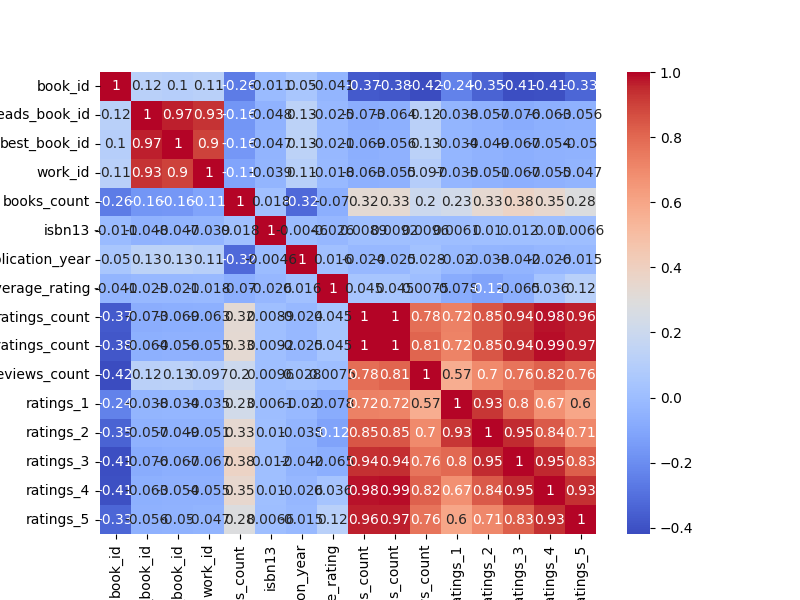
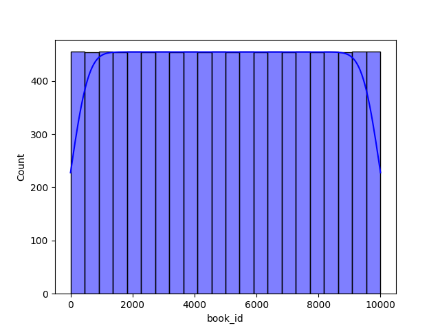
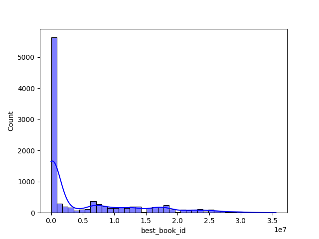

Once upon a time in the vast realm of literature, an intriguing dataset eagerly awaited exploration. This dataset, aptly named “goodreads.csv,” held the essence of countless stories, ratings, and reader experiences. With columns including book identifiers, authors, original publication years, and ratings, it promised to unveil the literary preferences of countless readers worldwide.

Excited by the possibilities, the data analyst donned their analytical hat and dove into the dataset. The journey began with an exploration of the **distribution of average ratings** across a spectrum of books. A histogram materialized, showcasing that most books hovered around average ratings of 4 to 5 stars. While many beloved titles received rave reviews, a scattering of lower ratings spoke of the reader’s diverse tastes and expectations. This initial insight sparked curiosity about what influenced such ratings.

Next, the analyst plotted a **scatter plot of ratings count against average ratings**. As the dots danced across the canvas, it became clear that books with higher ratings tended to attract more reviews. This confirmed a fascinating phenomenon—the crowd-sourced validation of popular books, which drew more attention, leading to even higher ratings. The scatter plot became a testament to the symbiotic relationship between popularity and critical acclaim.

Synonyms of fame and brilliance swayed in the analyst's mind, leading to the examination of **top authors by average rating**. A bar chart sprouted, illuminating the landscape of literary giants. Authors like Agatha Christie and J.K. Rowling stood tall, consistently earning high average ratings. This highlighted not just reading preferences, but also a certain trust built over years of storytelling, reinforcing the notion of author branding in the readers’ psyche.

As the adventure continued, historical context beckoned. A **line chart** was crafted to illuminate trends over publication years. The passage of time revealed a profound insight: while classic titles may hold their charm, contemporary books seemed to earn progressively higher average ratings. This reflection on time encouraged questions about what factors—writing style, societal relevance, and cultural shifts—influenced these changing perceptions.

With every dataset, language plays a crucial role. The analyst next turned to the **language code distribution**, visualizing the variety of languages represented in a colorful pie chart. English dominated the scene, but a sprinkle of titles in other languages hinted at the diverse tapestry of global literature. This insight about language diversity underscored the cultural richness contained within the dataset’s pages.

Feeling inquisitive, the analyst took a closer look at individual book ratings. A **stacked bar chart** was created for iconic titles like "The Hunger Games," "Harry Potter," and "Twilight." The visual breakdown showcased the nuances in how readers rated these beloved series, revealing a spectrum of opinions that told stories of personal connection to each narrative, demonstrating that averages alone could not capture the vibrant discussions among readers.

Diving deeper into the dataset, a **correlation heatmap** was conjured, revealing relationships among numeric features. It became evident that a book’s average rating closely correlated with its ratings count, reinforcing previous findings. However, it also hinted at intriguing dynamics, such as the impact of the number of 5-star reviews on overall perceptions.

The analyst understood that no data journey is complete without addressing the imperfections in its narrative. A **missing values analysis** highlighted the areas of the dataset that held gaps in information. This awareness sharpened the focus on data cleaning and preparation, ensuring that future analyses would remain robust and credible.

In a quest to understand the intricacies of authors' impacts, a **box plot** illustrated the relationship between the number of books published by an author and their average rating. Here, outliers sparked questions—did authors with a larger body of work deliver consistent quality, or did they falter at times? 

The final chapter focused on the **most reviewed books**. A bar chart blossomed, featuring the ten titles that sparked the most conversation among readers. This visual painted a vivid picture of book chatter, illuminating trends in discussions and indicating potential market movements.

Through this thorough exploration, the analyst pieced together a rich, multi-dimensional narrative of literature captured within the pages of goodreads.csv. The visualizations not only conveyed quantitative insights but also emphasized the subjective experiences of readers. The journey through data unveiled shades of popularity, diversity, and shared love for books, demonstrating that each number and rating held a unique story waiting to be told. By blending data with narrative, the analyst emerged with actionable insights, poised to guide avid readers toward their next great literary adventure.

