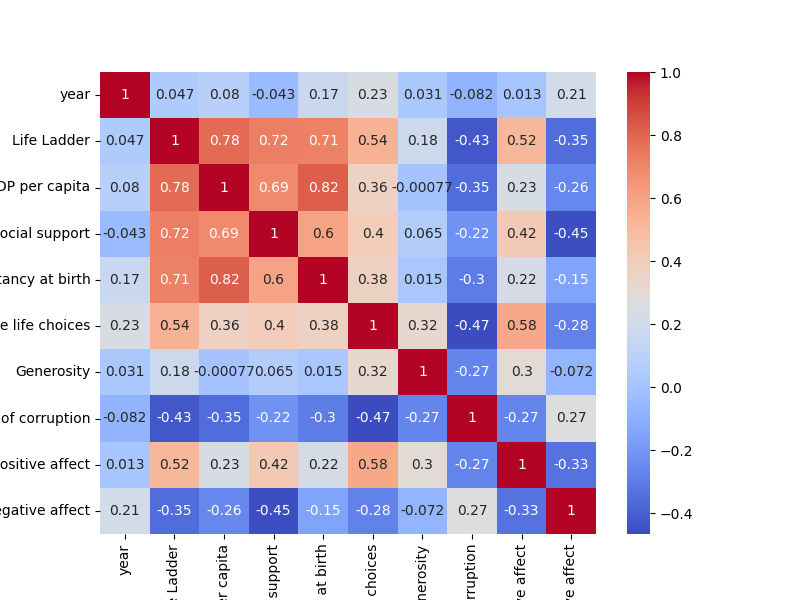
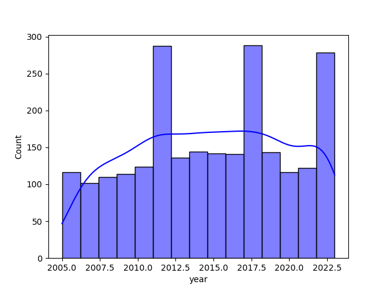
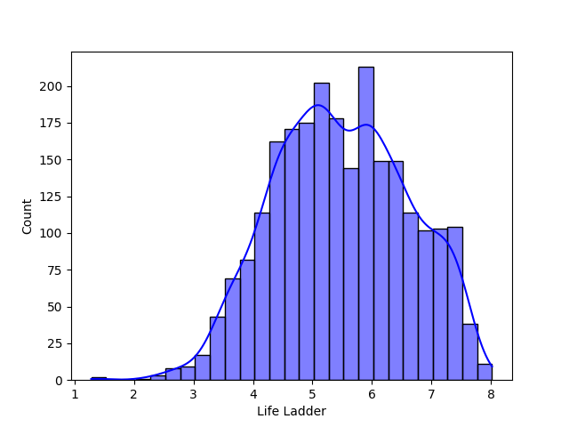
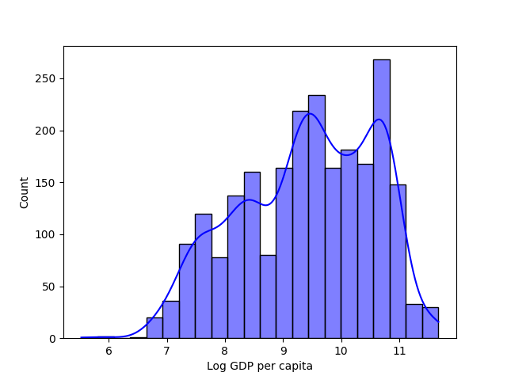

### The Journey Through Happiness: Analyzing Global Happiness Metrics

In the quest to understand what makes life worth living, we embarked on an extensive analysis of a dataset encapsulating happiness across various countries and years. The dataset, aptly named *happiness.csv*, contained a wealth of information including countries’ 'Life Ladder’ scores, which serve as proxies for happiness, alongside socioeconomic variables such as 'Log GDP per capita', 'Social support', and more. With these variables, we aimed to unearth the intrinsic links between societal well-being and various contributing factors.

#### Unveiling the Correlations

Our journey began with a correlation analysis, which aimed to illuminate how different factors interrelate with happiness. Utilizing a Pearson correlation analysis on the numerical columns of the dataset, we constructed a heatmap that revealed compelling insights—variables such as 'Social support' and 'Freedom to make life choices' boasted strong positive correlations with the ‘Life Ladder’. This suggestive relationship indicated that happier nations tended to support social connections and personal freedoms, which could guide policy and resource efforts toward fostering a more supportive societal framework.

#### Visualizing Change Over Time

Next, we turned our attention to understanding how these happiness metrics change over time, particularly in select countries. We generated line plots to capture the trajectories of countries like Sweden, the USA, and Afghanistan from year to year. The resulting visualizations told stories of resilience and varying degrees of happiness; while Sweden showed a steady upward trend indicative of progressive policies, Afghanistan’s fluctuating scores mirrored the socio-political turmoil it faced over the years. This temporal perspective highlighted the direct impact of historical events on the happiness of nations.

#### Profiling Happiness in Countries

To delve deeper, we crafted radar charts to create profiles for selected countries, analyzing key metrics that contribute to their happiness scores. It became clear that while some countries thrived on high 'Log GDP per capita', others like those in the Nordics, excelled in 'Social support' and 'Freedom to make life choices' despite similar economic standings. These revelations challenged traditional views on prosperity equating to happiness, showcasing that it is often a blend of various factors that craft a nation's overall well-being.

#### Dissecting Missing Values

An essential aspect of our analysis also involved assessing the impact of missing values on our dataset. We scrutinized countries with missing ‘Life Ladder’ scores and constructed bar charts that reflected the correlation between these gaps and the respective averages in happiness scores. It was evident that missing data could skew our overall understanding, particularly for nations experiencing rapid changes.

#### Classifying Happiness Levels

In a fascinating twist, we employed clustering techniques to classify countries into different happiness levels based on their Life Ladder scores and other metrics. Our visualization emerged as a vibrant plot, painting patterns of similarity among countries within the same happiness brackets. This analysis ventured into the heart of why nations tend to cluster together in happiness—whether it was due to shared cultural identities or similar governance styles.

#### Understanding Socioeconomic Contributions

To quantify the interplay of various factors, we conducted linear regression analyses that unveiled the extent to which socioeconomic factors accounted for variations in happiness. Regression plots provided poignant visuals where trends highlighted that while 'Log GDP per capita' explained much variance, surprisingly significant effects also stemmed from 'Social support' and 'Freedom to make life choices'. These findings reinforced the critical notion that economic prosperity alone does not guarantee happiness.

#### A Journey Across Regions

To compare happiness metrics across different geographical regions, we conjured up box plots. These visuals starkly illustrated that regions like Western Europe consistently outperformed others, while regions embroiled in conflict grappled with lower averages. This regional analysis suggested that cultural contexts and policies significantly shape patterns of happiness.

#### Emotional Underpinnings

Lastly, we delved into the emotional components of happiness. By creating scatter plots that examined the relationships between positive and negative affect with the Life Ladder, a clearer picture emerged. Not only did we see that countries with higher positive affect significantly correlated with higher happiness, but we also confirmed that high negative affect can severely dampen happiness levels. 

### Conclusion: The Threads of Insight

Through this multidimensional analysis of happiness metrics, we gleaned vital insights that transcended statistics. The narratives woven through our graphs and charts illustrate that happiness is an intricate tapestry of economic, social, and emotional threads. The implications of these findings stress the importance of holistic policies that recognize the blend of financial prosperity with enhanced social support and freedoms.

This analytical journey through our happiness dataset not only informs policymakers but also lays foundational stones for future research. By recognizing the multifaceted nature of happiness, we can endeavor to shape a world where well-being is a central focus of society.

